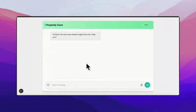

# Perplexity Clone

A modern AI-powered search and chat application that combines real-time web search with conversational AI, built with Next.js and FastAPI.


## 🎬 Demo



*Watch the application in action - real-time search, AI responses, and streaming functionality*

## ✨ Features

- 🔍 **Real-time Web Search**: Powered by Tavily Search API
- 🤖 **AI-Powered Responses**: Uses OpenAI's GPT-4o-mini for intelligent responses
- 💬 **Conversational Interface**: Chat-like experience with message history
- ⚡ **Real-time Streaming**: Live streaming of search results and AI responses
- 🎨 **Modern UI**: Clean, responsive design with Tailwind CSS
- 🔄 **Search Stages**: Visual feedback showing search progress (Searching → Reading → Writing)
- 💾 **Conversation Memory**: Maintains context across multiple messages
- 🌐 **CORS Enabled**: Ready for production deployment

## 🏗️ Architecture

```
┌─────────────────┐    ┌─────────────────┐    ┌─────────────────┐
│   Next.js       │    │   FastAPI       │    │   External      │
│   Frontend      │◄──►│   Backend       │◄──►│   APIs          │
│                 │    │                 │    │                 │
│ • React 19      │    │ • Python 3.9    │    │ • OpenAI API    │
│ • TypeScript    │    │ • LangChain     │    │ • Tavily API    │
│ • Tailwind CSS  │    │ • LangGraph     │    │                 │
│ • Server Events │    │ • Streaming     │    │                 │
└─────────────────┘    └─────────────────┘    └─────────────────┘
```

## 🚀 Quick Start

### Prerequisites

- Node.js 18+ 
- Python 3.9+
- OpenAI API Key
- Tavily API Key

### 1. Clone the Repository

```bash
git clone <your-repo-url>
cd Perplexity
```

### 2. Environment Setup

Create a `.env` file in the root directory:

```bash
# .env
OPENAI_API_KEY=your_openai_api_key_here
TAVILY_API_KEY=your_tavily_api_key_here
```

### 3. Backend Setup

```bash
# Navigate to server directory
cd server

# Create virtual environment
python -m venv venv

# Activate virtual environment
# On macOS/Linux:
source venv/bin/activate
# On Windows:
# venv\Scripts\activate

# Install dependencies
pip install fastapi uvicorn langchain-openai langchain-community langgraph python-dotenv

# Start the backend server
uvicorn app:app --reload --port 8001
```

### 4. Frontend Setup

```bash
# Navigate to client directory (in a new terminal)
cd client

# Install dependencies
npm install

# Start the development server
npm run dev
```

### 5. Access the Application

- Frontend: http://localhost:3000
- Backend API: http://localhost:8001
- API Docs: http://localhost:8001/docs

## 📁 Project Structure

```
Perplexity/
├── client/                 # Next.js Frontend
│   ├── src/
│   │   ├── app/           # App Router pages
│   │   │   ├── page.tsx   # Main chat interface
│   │   │   ├── layout.tsx # Root layout
│   │   │   └── globals.css# Global styles
│   │   └── components/    # React components
│   │       ├── Header.tsx # Navigation header
│   │       ├── MessageArea.tsx # Chat messages display
│   │       ├── InputBar.tsx # Message input
│   │       └── ClientOnly.tsx # SSR wrapper
│   ├── package.json
│   └── tailwind.config.js
├── server/                # FastAPI Backend
│   ├── app.py            # Main application
│   ├── requirements.txt  # Python dependencies
│   └── venv/            # Virtual environment
├── .env                  # Environment variables
└── README.md
```

## 🔧 API Endpoints

### Chat Stream
```
GET /chat_stream/{message}?checkpoint_id={id}
```

**Parameters:**
- `message`: The user's question/query
- `checkpoint_id` (optional): Conversation ID for context

**Response:** Server-Sent Events stream with:
- `checkpoint`: Conversation ID
- `search_start`: Search initiation
- `search_results`: Found URLs
- `content`: AI response chunks
- `end`: Stream completion

## 🎯 How It Works

1. **User Input**: User types a question in the chat interface
2. **AI Analysis**: GPT-4o-mini determines if web search is needed
3. **Web Search**: If needed, Tavily searches the web for relevant information
4. **Response Generation**: AI generates a comprehensive response using search results
5. **Real-time Streaming**: Response is streamed back to the user in real-time
6. **Visual Feedback**: User sees search stages and progress indicators

## 🛠️ Technologies Used

### Frontend
- **Next.js 15.3.0**: React framework with App Router
- **React 19**: Latest React with concurrent features
- **TypeScript**: Type-safe JavaScript
- **Tailwind CSS 4**: Utility-first CSS framework
- **Server-Sent Events**: Real-time communication

### Backend
- **FastAPI**: Modern Python web framework
- **LangChain**: LLM application framework
- **LangGraph**: Stateful LLM workflows
- **OpenAI GPT-4o-mini**: Language model
- **Tavily Search**: Web search API
- **Uvicorn**: ASGI server

## 🔑 Environment Variables

| Variable | Description | Required |
|----------|-------------|----------|
| `OPENAI_API_KEY` | OpenAI API key for GPT-4o-mini | Yes |
| `TAVILY_API_KEY` | Tavily API key for web search | Yes |

## 🚀 Deployment

### Backend Deployment (Railway/Heroku)

```bash
# Install dependencies
pip install -r requirements.txt

# Set environment variables
export OPENAI_API_KEY=your_key
export TAVILY_API_KEY=your_key

# Run with gunicorn
gunicorn app:app -w 4 -k uvicorn.workers.UvicornWorker
```

### Frontend Deployment (Vercel)

```bash
# Build the application
npm run build

# Deploy to Vercel
vercel --prod
```

## 🎨 Customization

### Styling
- Modify `client/src/app/globals.css` for global styles
- Update Tailwind classes in components for design changes
- Customize the header in `client/src/components/Header.tsx`

### AI Behavior
- Adjust model parameters in `server/app.py`:
  ```python
  model = ChatOpenAI(model="gpt-4o-mini", temperature=0)
  ```
- Modify search results count:
  ```python
  search_tool = TavilySearchResults(max_result=4)
  ```

## 🐛 Troubleshooting

### Common Issues

1. **CORS Errors**
   - Ensure backend is running on port 8001
   - Check CORS middleware configuration

2. **API Key Errors**
   - Verify `.env` file exists in root directory
   - Check API keys are valid and have sufficient credits

3. **Streaming Issues**
   - Check browser console for errors
   - Verify EventSource connection

4. **Search Not Working**
   - Confirm Tavily API key is valid
   - Check network connectivity

## 📝 Development

### Adding New Features

1. **New AI Tools**: Add to `tools` array in `server/app.py`
2. **UI Components**: Create in `client/src/components/`
3. **API Endpoints**: Add to FastAPI app in `server/app.py`

### Code Style

- **Python**: Follow PEP 8
- **TypeScript**: Use strict mode
- **React**: Functional components with hooks

## 📄 License

This project is licensed under the MIT License - see the LICENSE file for details.

## 🤝 Contributing

1. Fork the repository
2. Create a feature branch (`git checkout -b feature/amazing-feature`)
3. Commit your changes (`git commit -m 'Add amazing feature'`)
4. Push to the branch (`git push origin feature/amazing-feature`)
5. Open a Pull Request

## 🙏 Acknowledgments

- [OpenAI](https://openai.com/) for GPT-4o-mini
- [Tavily](https://tavily.com/) for search API
- [LangChain](https://langchain.com/) for LLM framework
- [Next.js](https://nextjs.org/) for React framework
- [FastAPI](https://fastapi.tiangolo.com/) for Python web framework

## 📞 Support

If you encounter any issues or have questions:

1. Check the [Troubleshooting](#-troubleshooting) section
2. Search existing [Issues](../../issues)
3. Create a new issue with detailed information

---

**Built with ❤️ using modern web technologies**
